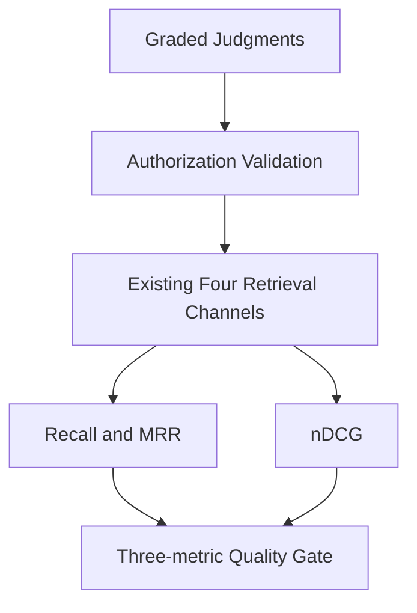

# Advanced RAG Phase 32：Graded Relevance 与 nDCG

Phase 31 的 Recall@K 和 MRR@K 把所有相关 Chunk 看成同等重要。Phase 32 进一步回答：

> 如果“直接回答问题的条款”和“只提供背景的条款”都被召回，系统是否把更有价值的证据排在前面？

## 1. 它是什么

Graded Relevance 为每个 Query–Chunk 标注赋予相关性等级：

| Grade | 名称 | 判断标准 | 示例 |
|---:|---|---|---|
| 3 | Highly relevant | 能直接回答问题或构成答案不可缺少的主条款 | 普通员工一类城市住宿上限 |
| 2 | Supporting | 不能独立完成回答，但提供必要映射或规则背景 | 北京属于一类城市 |
| 1 | Marginal | 与问题有关，可补充上下文，但不是答案主证据 | 培训费用范围和事前审批背景 |

等级 0 表示不相关，不写入 judgments。每条正相关标注还必须包含人工 `rationale`，使争议可以
复核，而不是只保存一个无法解释的数字。

## 2. 输入、输出和 Pipeline 位置

输入仍是 `tests/evaluation/retrieval_test_cases.jsonl`，但标注从 Phase 31 的二元 ID 数组升级为：

```json
{
  "case_id": "RET-001",
  "query": "普通员工去北京出差，每晚住宿费上限是多少？",
  "judgments": [
    {
      "chunk_id": "TRAVEL_POLICY_001__v1_0__article_008",
      "relevance": 3,
      "rationale": "直接给出普通员工一类城市每晚住宿上限"
    },
    {
      "chunk_id": "TRAVEL_POLICY_001__v1_0__article_007",
      "relevance": 2,
      "rationale": "用于确认北京属于一类城市"
    }
  ]
}
```

旧 `relevant_chunk_ids` 输入仍可加载，并在模型边界一次性转换为 Grade 3；内部只保存
`judgments`，避免两个字段成为相互冲突的事实来源。



输出继续写入 Phase 31 的 JSON / Markdown 报告路径，但报告 schema 升级为 `2.0`，新增：

- 每条用例的等级和标注理由；
- 每个通道的 nDCG@1/3/5；
- nDCG@5 门禁阈值；
- Markdown 中的 G1/G2/G3 标识。

## 3. nDCG 如何计算

对排名位置 $i$ 的相关性等级 $rel_i$，本项目使用指数增益：

$$
gain(rel_i) = 2^{rel_i} - 1
$$

$$
DCG@K = \sum_{i=1}^{K}\frac{2^{rel_i}-1}{\log_2(i+1)}
$$

相同 judgments 的理想排序产生 $IDCG@K$：

$$
nDCG@K = \frac{DCG@K}{IDCG@K}
$$

nDCG 范围为 0–1。Grade 3 在第一位时贡献最大；把 Grade 1 放到 Grade 3 前面，即使 Recall@K
完全相同，nDCG 也会下降。指数增益让 Grade 3 和 Grade 2 的差别比 Grade 2 和 Grade 1 更明显，
符合“直接制度依据优先”的 Context Builder 需求。

实现会忽略同一 Chunk ID 的重复排名贡献，避免错误 Retriever 通过重复返回高等级 Chunk 抬高分数。

## 4. 与 Recall、MRR 的关系

| 指标 | 主要回答 | 看不见的问题 |
|---|---|---|
| Recall@K | 相关证据是否找全 | 不关心结果内部顺序和等级 |
| MRR@K | 第一个相关证据是否靠前 | 第一个命中后，不关心其余证据 |
| nDCG@K | 高等级相关证据是否整体靠前 | 不直接表达相关项找全比例 |

所以三项不能互相替代。一个排序可能 Recall@5=1、MRR@5=1，但先放 Grade 1 再放 Grade 3，
nDCG 仍会失败。Phase 32 的测试专门覆盖了这个反例。

默认正式通道门禁是：

```text
Hybrid / Reranked:
Recall@5 >= 0.80
MRR@5    >= 0.80
nDCG@5   >= 0.80
```

Vector 和 BM25 仍作为消融对照，不单独阻塞 CI。

## 5. 离线结果

当前 20 条、三等级 judgments 的确定性回归结果：

| 通道 | Recall@5 | MRR@5 | nDCG@5 |
|---|---:|---:|---:|
| Vector fixture | 77.50% | 80.42% | 77.30% |
| BM25 | 90.00% | 92.50% | 89.62% |
| Hybrid / RRF | 85.00% | 87.92% | 84.98% |
| Reranked fixture | 87.50% | 93.50% | 88.32% |

新增 supporting/marginal evidence 后，Recall 分母变大，因此不能把这些数值与 Phase 31 二元数据
直接做同比。报告的数据集 SHA-256 和 schema version 用于阻止这种错误比较。

运行：

```powershell
python -X utf8 -m scripts.run_retrieval_evaluation --mode offline
python -X utf8 -m scripts.verify_graded_relevance
```

## 6. 为什么当前选择 nDCG

替代方案包括：

- Precision@K：适合关注 Context 中噪声比例，但当前 judgments 没有完整标注 199 个 Chunk；
- MAP：适合多个二元相关项，但表达不了 Grade 3 和 Grade 1 的差异；
- ERR：考虑用户逐项浏览和满意概率，解释成本更高；
- LLM-as-a-Judge：能扩展标注，但存在不稳定、偏见、成本和敏感数据边界问题。

当前数据规模小、制度条款有稳定 ID、人工等级可解释，因此 nDCG 是最小且合理的增量。

## 7. 安全模型没有改变

Graded judgments 只改变离线评测，不参与线上授权决策。评测运行前仍验证：

```text
Judged Chunk exists
→ Judged Chunk is authorized for trusted evaluation identity
→ Retrieval scores only authorized candidates
→ RRF
→ Reranker
```

不能为了提高 nDCG 把未授权高等级 Chunk 送进 Vector、BM25 或 Reranker。

## 8. 生产不足

- 等级由单一开发者标注，尚无双人标注和 Cohen's kappa 一致性；
- 20 条 Query 太少，不能代表真实企业语言分布；
- judgments 没有完整 pool depth，可能漏标其他有效 Chunk；
- 尚未加入无答案 Query、版本冲突、OCR 噪声和跨权限 Query 切片；
- 离线 Provider 不是 BGE，当前 nDCG 只用于工程回归；
- 还没有固定硬件上的真实 BGE、候选 K 和 pgvector HNSW Recall–Latency 实验。

## 9. 面试追问

**为什么增益使用 $2^{rel}-1$，而不是直接使用 rel？** 指数增益更强地奖励直接回答问题的主条款，
符合制度问答中权威主证据优先的目标；线性增益也是可选方案，但必须在实验协议中固定。

**nDCG=1 是否代表检索完美？** 只代表在已标注 judgments 和 K 范围内顺序达到理想；如果标注漏掉
有效条款或 Query 分布失真，nDCG=1 仍不能代表生产质量。

**为什么保留 MRR？** nDCG 看整体有序质量，MRR 对第一个可用证据的位置更直观。在线回答通常
对 Top-1/Top-2 很敏感，两者提供不同诊断信号。

**如何标注跨制度问题？** 先把问题拆成可验证的信息需求，为每个不可缺少的直接条款标 Grade 3，
必要映射或定义标 Grade 2，只提供背景的条款标 Grade 1；由第二位标注者复核争议。

**下一步如何用于 ANN 调参？** 固定 Query、judgments、Embedding 和 corpus，在不同 HNSW 参数下
同时测 nDCG/Recall 与 p95；只有延迟改善且质量下降在预算内，才接受近似索引配置。
