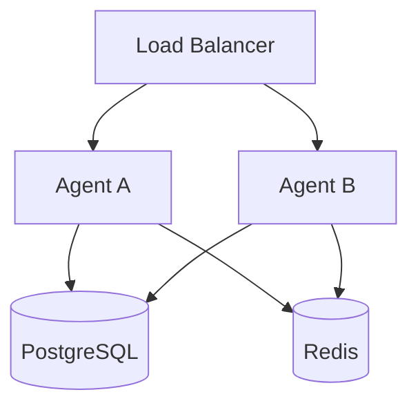

# Phase 38：Multi-instance Shared State

## 1. 当前结论

本设计以 GitHub `main` 的 `b37277953a663930cc01a251b5f0de71d7284b4f` 为审计基线。
代码、测试和 CI 表明 Advanced RAG Phase 37 已完成；Phase 38 还没有进入运行时实现。

当前 Agent 的 checkpoint、会话投影、草稿快照、对话记忆、提交回执、幂等记录和提交审计，
全部写入 `SQLITE_DATABASE_PATH` 指向的同一个 SQLite 文件。Compose 只启动一个 Agent，
并把这个文件放在 `agent_runtime` 具名卷中。该方案能通过单实例重启恢复，但不能让两个拥有独立
文件系统的 Agent 实例看到同一份状态。

PostgreSQL 已用于 pgvector、Collection Release、Indexing Lease 和 Collection GC；Redis 已用于
可丢失、可重建的 LLM 响应缓存。这两类现有能力可以复用，但 Phase 38 不修改 RAG 检索、安全顺序
或 Collection 控制面。

本阶段的机器可读事实来源是
[`docs/multi_instance_state_inventory.json`](multi_instance_state_inventory.json)。Step 1 只建立清单和
验证契约，没有创建 PostgreSQL runtime 表、没有复制 SQLite 数据，也没有切换 FastAPI 后端。

## 2. 本阶段解决什么问题

目标拓扑为：

必须成立两条业务契约：

1. 请求在 A、B 之间切换时，相同 `session_id` 仍能继续同一 LangGraph workflow；
2. A 在提交前后崩溃时，B 能恢复草稿，并且同一已确认草稿最多产生一个提交回执。

当前实现无法保证这两条契约，原因不是 SQLite 不能持久化，而是每个实例拥有不同的状态副本；
同时 `AgentWorkflow._session_locks`、single-flight、Provider 队列和运行指标都只存在于单个 Python
进程中。

## 3. 当前状态清单

### 3.1 Durable state

| 状态 | 当前后端 | 当前事实来源 | Phase 38 目标 | 关键约束 |
| --- | --- | --- | --- | --- |
| LangGraph checkpoint / blobs / writes | SQLite | workflow 恢复事实来源 | PostgreSQL | thread 内有序、可中断恢复 |
| Agent session head | SQLite | checkpoint 的查询投影 | PostgreSQL | 单调 revision，禁止旧 turn 覆盖 |
| Application draft revisions | SQLite | checkpoint 的版本化投影 | PostgreSQL | `(draft_id, revision)` 不可变 |
| Sanitized conversation memory | SQLite | follow-up context 来源 | PostgreSQL | 原子 turn、脱敏、截断、50 轮上限 |
| Submitted application + approval workflow | SQLite | 副作用回执事实来源 | PostgreSQL | idempotency key 和 draft 都唯一 |
| Submission audit | SQLite | 提交与 replay 审计事实来源 | PostgreSQL | 与提交事务一致、追加式 |
| Vector / release / lease / GC | PostgreSQL | RAG 控制面事实来源 | 保持 PostgreSQL | 不改变 fencing、CAS、GC 保护 |

`agent_sessions` 和 `application_draft_snapshots` 是便于查询的投影；LangGraph checkpoint 是 workflow
恢复事实来源。`approval_submissions` 则是副作用是否已经发生的事实来源。Phase 38 不使用跨数据库
分布式事务：投影失败可以从 checkpoint 重建，但提交回执与提交审计必须在一个 PostgreSQL 事务中
完成。

### 3.2 Ephemeral or reconstructable state

| 状态 | 当前范围 | 决策 |
| --- | --- | --- |
| Redis LLM cache | 跨实例（启用时） | 保留；继续 fail-open，绝不存 workflow 正确性状态 |
| Session `asyncio.Lock` | 单进程 | Phase 38 改为 token-owned Redis lease，并保留数据库冲突保护 |
| Async single-flight registry | 单进程 | Phase 43 再做分布式实验；不影响 Phase 38 正确性 |
| Provider FIFO / concurrency | 单进程 | Phase 43 处理全局配额；本阶段不伪装成集群限制 |
| HTTP / security / provider metrics | 单进程 | Phase 40 集中聚合；本阶段只增加必要的 backend/conflict 指标 |
| In-memory vector provider | 单进程、可重建 | 本地测试可用；multi-instance profile 必须显式使用 pgvector |
| Model artifact cache | 文件系统、可重建 | 可按实例缓存；不能放业务状态或身份信息 |

## 4. Architecture Decision

### 4.1 Durable state 为什么选 PostgreSQL

候选方案：

| 方案 | 优点 | 问题 | 决策 |
| --- | --- | --- | --- |
| 共享 SQLite 文件 | 改动最少 | 容器卷和文件锁不适合作为横向扩展一致性边界；故障域仍是文件 | 拒绝 |
| 全部放 Redis | 延迟低、TTL 和锁方便 | workflow、提交和审计可能因淘汰或持久化策略丢失；事务查询能力不足 | 拒绝 |
| PostgreSQL durable + Redis ephemeral | 复用现有基础设施；事务、唯一约束和行级并发清晰 | 需要 schema、repository、迁移和集成测试 | 采用 |

PostgreSQL 是 durable source of truth。Redis 只保存有 TTL、可重建的协调状态。Redis 中不能存唯一的
草稿、确认状态、提交结果、身份、权限或审计记录。

### 4.2 不做永久 dual-write

长期同时写 SQLite 和 PostgreSQL 会产生新的“双事实来源”问题。最终切换采用显式 provider：

- `sqlite` 仅保留给单机开发和迁移前兼容；
- `postgresql` 用于 multi-instance profile；
- PostgreSQL 配置失败时 fail closed，不静默回退到本地 SQLite；
- 历史数据通过一次性、可重复校验的导入命令迁移，切换窗口内停止写入。

### 4.3 LangGraph checkpoint

优先采用 LangGraph 官方 PostgreSQL checkpointer，并在项目内增加生命周期适配层：

- 复用现有 `BaseCheckpointSaver` 注入边界和当前 serializer allowlist；
- 固定并验证兼容版本，启动时显式执行幂等 schema setup；
- 使用 async PostgreSQL pool，避免把数据库 I/O 移到无限 worker thread；
- 用现有 checkpoint contract、HITL interrupt/resume 和 delete-thread 测试验收；
- 应用表仍使用项目自己的 repository，不把业务草稿或提交塞进通用 LangGraph Store。

这样减少自写 checkpoint 协议的风险，同时不改变 `AgentWorkflow` 图结构。

### 4.4 Repository 边界

现有接口可以直接复用：

- `BaseCheckpointSaver`：替换 checkpointer；
- `AgentStatePersister`：扩展 PostgreSQL session/draft projection；
- `ConversationMemoryStore`：扩展 PostgreSQL conversation store；
- `ApplicationSubmitter`：扩展 PostgreSQL idempotent submitter；
- `Settings` 和 FastAPI lifespan：增加显式 provider factory 和资源关闭。

不新建另一套 Agent、Workflow、Draft、Submission 或 RAG 模型。

## 5. 一致性设计

### 5.1 同一 session 的并发请求

Phase 38 使用两层保护：

1. Redis session lease 做正常路径的跨实例互斥；
2. PostgreSQL revision/unique constraints 做最终正确性保护。

Redis lease 使用随机 owner token、`SET NX PX`、compare-and-renew、compare-and-delete 和 heartbeat。
Redis key 只包含 session ID 的摘要，不保存用户正文。锁丢失后当前请求不得进入提交节点；API 返回稳定的
冲突/暂不可用结果，由客户端重新读取最新状态，不能自动重试副作用。

数据库仍必须拒绝：

- 旧 session revision 覆盖新 revision；
- 同一 idempotency key 绑定不同 draft/user/session；
- 同一 draft 绑定第二个 submission；
- 同一 conversation turn/role 重复插入。

### 5.2 提交和崩溃窗口

提交事务同时写入 submission receipt 和 audit record。结果分三种：

| 崩溃位置 | Agent B 的行为 |
| --- | --- |
| PostgreSQL commit 前 | 没有回执；从已确认 draft 恢复并允许用户再次显式提交 |
| commit 后、HTTP response 前 | 相同确定性 idempotency key 命中原回执，返回 replay，不创建第二单 |
| checkpoint/projection 更新失败 | submission receipt 优先；恢复时按回执把 workflow 投影修正为 submitted |

### 5.3 Session reset

当前 reset 依次删除 checkpoint、session/draft projection 和 conversation，任一步失败都可能留下部分状态。
PostgreSQL 版本先原子写入 session tombstone，使后续 resume fail closed，再幂等清理 checkpoint 和历史；
只有 tombstone 成功后 API 才能报告 session 已清除。审计和提交回执不随普通 session reset 删除。

## 6. Failure Mode

| 故障 | 行为 |
| --- | --- |
| PostgreSQL 不可用 | readiness 失败；workflow mutation 返回 503；绝不回退 SQLite |
| Redis cache 不可用 | 保持现有 cache fail-open，直连 LLM |
| Redis session coordinator 不可用 | multi-instance workflow mutation fail closed；不能假装仍有互斥 |
| Agent A crash | lease TTL 后由 B 接管；B 从 PostgreSQL checkpoint 恢复 |
| lease heartbeat 丢失 | 在任何副作用前再次验证；丢锁请求停止 |
| 两实例同时提交 | PostgreSQL unique constraints 只允许一个 first submission，另一个读取 replay |
| stale projection | checkpoint/receipt 为事实来源，projection 通过 reconciliation 修复 |
| 迁移中断 | 导入按自然键幂等；校验数量和摘要后才切换 provider |

## 7. Security

- 保持 `PromptInjectionGuard` 在 `AgentRouter.route()` 调用 workflow 之前执行；
- 保持 Trusted Identity → Authorization → authorized Vector/BM25 → RRF → Reranker → Context；
- 状态后端不能从自然语言或请求 body 推导角色、部门、clearance；
- Redis key 不含 prompt、对话正文、员工姓名或数据库凭据；
- PostgreSQL JSONB 仍保存现有脱敏后的 conversation content；日志只记录 backend、operation、outcome、
  latency 和冲突类型；
- Session 与身份绑定的强制验证属于 Phase 39 Authentication/RBAC，但 Phase 38 schema 要预留稳定 owner key，
  不能把客户端自报身份写成可信 owner；
- 普通 reset 不删除 append-only submission audit。

## 8. Observability

Phase 38 至少记录：

- state operation duration / error / conflict；
- session lease acquire、wait、timeout、lost、release；
- checkpoint resume source instance 与 backend；
- idempotent first-submit / replay / conflict；
- PostgreSQL 和 Redis 独立 readiness。

指标标签必须有界，不使用原始 session ID、draft ID、employee ID、prompt 或异常正文。跨实例 trace 和集中指标
聚合留给 Phase 40。

## 9. 测试策略

### Unit

- schema 和 repository SQL 契约；
- serializer allowlist 与 checkpoint CRUD；
- Redis token ownership、renew、release 和丢锁；
- revision CAS、idempotency 与 audit transaction。

### Integration

- 真实 PostgreSQL schema migration / rollback-safe setup；
- 真实 Redis lease TTL 和 owner-token 校验；
- 两个独立 Router/App 实例共享 PostgreSQL/Redis。

### Failure and recovery

- A 建 draft，B 修改和确认；
- A 在等待确认时退出，B resume；
- commit 后模拟 response 丢失，再由 B 重试；
- Redis、PostgreSQL、Agent 分别失效；
- 并发相同 session，只允许一个 mutation owner；
- reset 中断后 session 仍 fail closed。

### Security regression

- 未授权 Chunk 仍在 Vector/BM25 评分前排除；
- prompt injection 仍在 retrieval/workflow/tool 前阻断；
- 不可信身份不能绑定或读取另一用户 session；
- 锁、日志、metric 不暴露敏感正文。

## 10. Phase 38 分步计划

| Step | 目标 | 主要产物 | 进入下一步的门槛 |
| --- | --- | --- | --- |
| 1 | State Inventory | 机器清单、ADR、离线 verifier、pytest | 所有 SQLite 表与单实例依赖都有明确归属 |
| 2 | PostgreSQL configuration + schema | 独立 runtime DSN、migration、DDL | 幂等建表；尚不切换 runtime |
| 3 | PostgreSQL repositories | session/draft、memory、submission/audit | 事务、CAS、唯一约束和 repository tests 通过 |
| 4 | PostgreSQL checkpointer | 官方 saver 生命周期适配、HITL 恢复 | A 写 checkpoint，B 可 resume |
| 5 | Redis session coordination | token lease、heartbeat、lost-lock guard | 同 session 跨实例互斥；丢锁不提交 |
| 6 | Runtime cutover + one-time import | provider factory、lifespan、health、SQLite importer | 无静默 fallback；导入可校验、可重跑 |
| 7 | Multi-instance / failover tests | A/B 连续办理、crash/replay/no-duplicate | 两实例和故障验收全部通过 |
| 8 | Documentation + CI gate | README、Compose 验收、CI services/evidence | 全量 pytest/Ruff/专项/真实依赖 gate 通过 |

本轮只完成 Step 1。Step 2 及之后的 schema、dependency、runtime 和 Compose 修改均未开始。

## 11. Step 1 完成标准

- GitHub `main` commit、README、目录、tests/scripts/docs/workflow 已审计；
- `docs/multi_instance_state_inventory.json` 覆盖 SQLite schema 中全部 8 张表；
- 每个 durable SQLite asset 的目标后端都是 PostgreSQL；
- Redis 只承载 ephemeral state；
- 所有 correctness/continuity 单实例依赖有明确 Phase 38 处置；
- Phase 40/43 的指标聚合、distributed single-flight 和 global backpressure 明确延后；
- verifier、pytest、Ruff 和现有专项验证通过；
- runtime migration 仍为 `false`。

## 12. 生产环境仍有的不足

即使 Phase 38 完成，系统仍缺少 Phase 39 的真实认证与 session ownership enforcement、Phase 40 的集中
trace/metrics/log、数据库备份恢复演练、跨区域容灾、密钥轮换、容量基线和正式 SLO。Phase 38 只证明共享
状态和故障接管，不等于完整生产就绪。

## 13. 面试官可能追问

### 为什么不把 workflow 全放 Redis？

Redis 适合 TTL cache 和短租约；workflow、确认、提交与审计需要事务、唯一约束、可查询历史和明确恢复点。
因此 PostgreSQL 是事实来源，Redis 只协调。

### Redis lock 能保证 exactly-once 吗？

不能。租约可能过期或在网络分区中失去所有权。锁减少并发，真正防重依赖 PostgreSQL 唯一约束、确定性
idempotency key 和提交回执 replay。对外表达应是“effectively-once business effect”，不是网络层
exactly-once。

### 为什么 checkpoint 和 session projection 不做分布式事务？

checkpoint 是恢复事实来源，session/draft head 是可重建投影。把所有写入强耦合会扩大事务和库适配复杂度。
关键副作用提交与审计必须同事务；投影则通过 revision 和 reconciliation 达到一致。

### Agent A commit 后崩溃，B 为什么不会重复提交？

确认后的 draft 生成稳定 idempotency key；PostgreSQL 同时对 idempotency key 和 draft ID 建唯一约束。
B 的相同请求读取已存在的 receipt，返回 replay，而不是再次执行 first submission。

### 为什么 Phase 38 不顺手做 distributed single-flight 和 global backpressure？

它们解决 Provider 成本与容量，不决定 workflow 正确性。先完成状态事实来源、跨实例恢复和副作用防重；
全局 Provider 协调需要独立容量与故障实验，放在 Phase 43 更容易验证和回滚。
