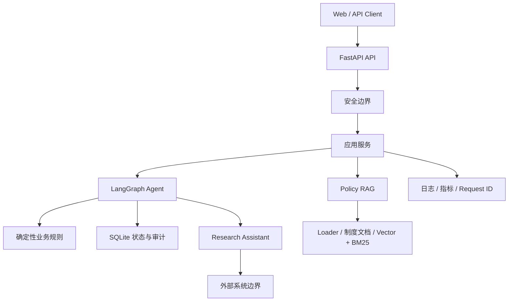
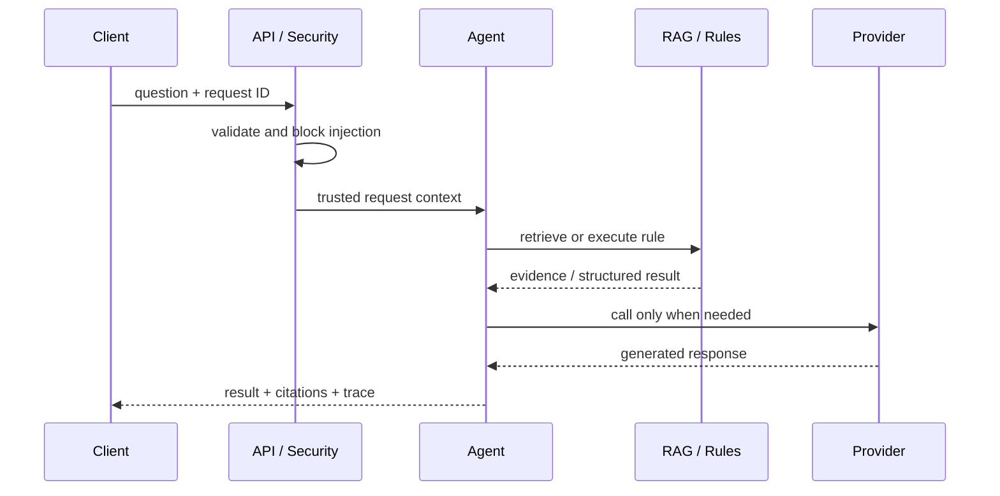
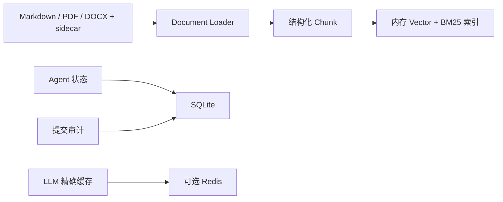

# 企业制度问答与流程办理 Agent：系统架构

本文描述 Advanced RAG Phase 26 仓库中已经实现并有测试证据的架构，不把规划中的能力画成现状。

## 1. 运行时架构

请求首先经过 FastAPI 输入校验、请求 ID 和提示注入检查。制度问答在可信身份允许的 Chunk
范围内进行向量或 BM25 评分，构建带 `S1/S2` 映射的 JSON 证据，再交给 LLM。业务办理由 LangGraph
编排，但材料、金额、审批路线、草稿状态和提交幂等性由确定性代码负责。

## 2. 一次请求的关键顺序

提示注入被拒绝时，请求在 `A` 阶段结束，不会到达检索、Web Search、工具或 LLM Provider。
副作用提交只有在草稿完整且用户显式确认后才进入提交节点。

## 3. 组件职责

| 组件 | 负责 | 不负责 |
|---|---|---|
| FastAPI | Schema 校验、依赖注入、错误映射、Request ID | 业务规则计算 |
| Prompt Guard | 高信号输入攻击阻断、污染证据隔离 | 完整开放世界攻击识别 |
| Policy Access | 状态、日期、等级、部门、角色、区域授权 | 登录和员工目录 |
| Policy RAG | Loader 路由、解析、Chunk、Embedding、检索、上下文、引用 | 决定审批路线 |
| LangGraph | 意图分支、多轮状态、确认节点、工具编排 | 自行创造业务规则 |
| Rule Tools | 材料检查、审批路线、草稿字段计算 | 生成开放式自然语言 |
| Persistence | SQLite checkpoint、会话、提交和审计 | 多节点分布式一致性 |
| Research | 内部制度优先、显式外部检索、S/W 来源分区 | 用外部资料驱动审批 |
| Observability | 脱敏日志、低基数指标、安全错误关联 | 集中式 Trace 和全局指标 |

## 4. 信任边界

### 4.1 安全边界

- 用户消息、Header 中的身份自述均不可信；
- 制度访问上下文只能由服务端认证或可信夹具创建；
- 用户问题和检索证据都作为不可信 JSON 数据传入 Prompt；
- 检索到的制度内容仍需提示注入检查；
- 日志、指标和安全错误不记录原始问题、制度正文或命中规则。

### 4.2 副作用边界

- 草稿创建不等于提交；
- 提交前必须有完整草稿和显式确认；
- 提交工具固定单次执行，不进行自动重试；
- 幂等键保证重复提交复用同一结果；
- 已提交草稿不可继续修改。

### 4.3 外部系统边界

- Web Search 默认关闭，必须由请求显式授权且服务端已配置 Provider；
- 外部网页只作为 `W` 来源的研究参考；
- 外部信息不能进入材料、审批、草稿或提交判断；
- Day 30 离线演示使用固定 Web 夹具，不产生网络调用。

## 5. 数据与状态

- 制度索引目前为单进程内存结构，正式 BGE 默认维度为 512，BM25 使用同一批 `retrieval_text`；
- 可信身份先产生授权 Chunk 白名单；向量相似度与 BM25 候选、DF、平均长度和评分都只能查看该白名单；
- Vector 与 BM25 在 Phase 26 仍是独立通道，Hybrid Search 和 RRF 尚未启用；
- Loader Registry 注册 Markdown、PyMuPDF 和 python-docx Loader；PDF/DOCX 可显式注入 OCR Provider；
- PDF/DOCX 权限元数据来自受控 sidecar；PDF 保留页码，DOCX 保留顶层块范围；
- OCR 低置信度结果在 Parser/索引前拒绝，通过结果保留 engine、单元与置信度来源；
- 会话、checkpoint、提交和审计可以使用 SQLite 跨重启恢复；
- Redis 只用于可选 LLM 精确请求缓存，不是当前会话主存储；
- HTTP 指标、Provider 指标和安全计数是进程内状态。

## 6. 部署拓扑

当前 Compose 是单个 Agent 容器、可选 Redis 容器和具名卷。该拓扑适合作品集演示和单机验收，
不代表多实例生产架构。生产化至少还需要真实认证、集中策略服务、PostgreSQL/pgvector、集中
日志指标、OpenTelemetry、密钥管理、备份恢复和跨实例容量协调。
